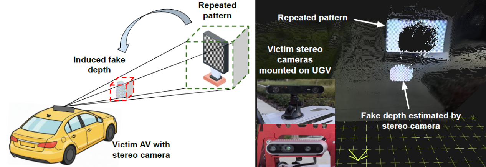
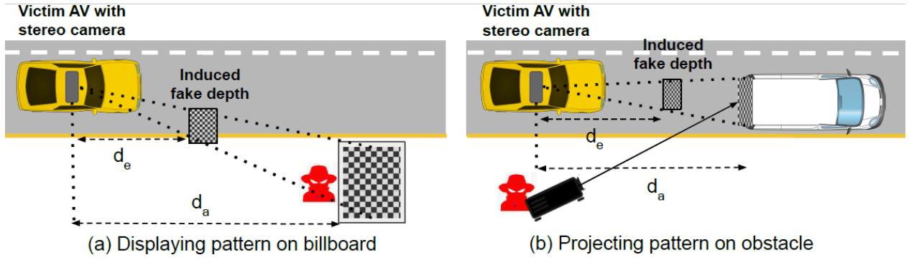
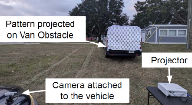
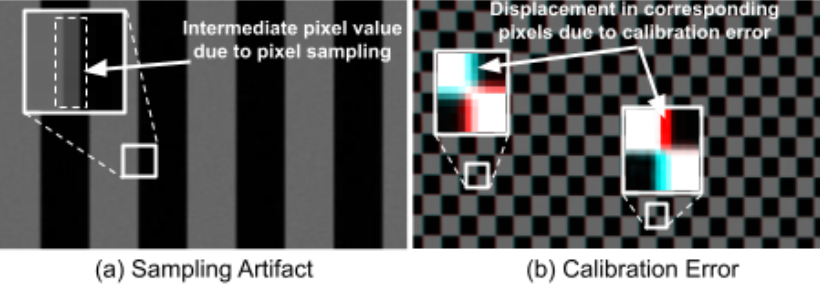

To appear in [ACM CCS 2026](https://www.sigsac.org/ccs/CCS2026/), The Hague, Netherlands.

## Abstract

Stereo cameras are integrated into autonomous systems such as self-driving cars, drones, and robots to offer precise depth estimation in a cost-effective manner compared to LiDAR technology. In this work, we reveal intrinsic vulnerabilities in the stereo cameras' inherent image pixel sampling and calibration processes. Attackers can exploit these vulnerabilities by using simple repeated patterns to exert fine-grained control over the estimated depth of genuine obstacles. Rather than inducing random depth errors, an attacker can systematically manipulate the depth of obstacles perceived by the victim autonomous systems. 

*Our attack induces controlled depth estimation errors in stereo cameras. The attack exploits inherent stereo-camera vulnerabilities by exploiting structured, repeated patterns placed in the scene, such as those displayed on roadside billboards.*

## Demonstration of the Attack

We assess the attack on two popular stereo cameras, ZED2 and RealSense D435i, in real-world driving conditions with the vehicle moving up to speeds of 15 km/h. The attack persists for at least 0.5 sec in both day and night lighting conditions, sufficient to trigger emergency braking or unsafe maneuvers in state-of-the-art autonomous driving frameworks.  

*(video to be added by Hrushikesh: realsense.mp4)*

*Visualization of the attack on the RealSense D435i camera in real world scenario.*

*(video to be added by Hrushikesh: zed2.mp4)*

*Visualization of the attack on the ZED2 camera in real world scenario.*

*Illustration of scenarios explored in this work: the projected pattern on a billboard and the back of a van.*

*(video to be added by Hrushikesh: Video 2025-12-14 at 7.41.04 PM(1).mp4)*

*(video to be added by Hrushikesh: Video 2025-12-14 at 7.41.07 PM.mp4)*

*Illustration of the real-world setup used to evaluate the attack with the pattern projected on the back of a van obstacle. The setup emulates a van parked on the side of a road or in an adjacent lane. As seen in the videos, the van obstacle is not in the trajectory of the victim vehicle.*

## The Hidden Vulnerabilities

Our study identifies two intrinsic characteristics of stereo cameras that enable depth manipulation:

**(a) Sampling Artifacts.** Pixel-level distortions introduced when continuous visual data is discretized into pixels on an image sensor. These artifacts produce intermediate pixel intensity values at high-contrast boundaries.

**(b) Calibration Errors.** Pixel-level inaccuracies caused by manufacturing variations and lens distortions, which warp feature information used by stereo matching algorithms. These distortions cause corresponding pixels in the left and right images to be displaced in different directions.

## Acknowledgments

*(to be added)*
